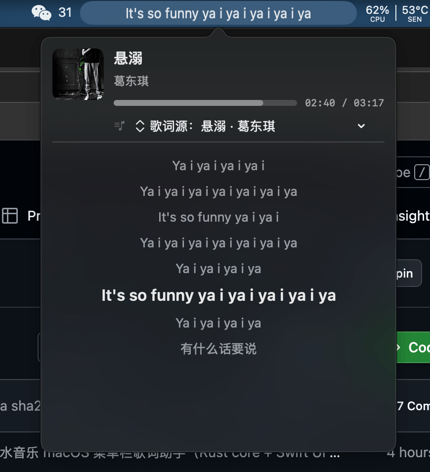

# 🎵 汽水歌词 · SodaLyrics

macOS 菜单栏歌词助手：在**顶部状态栏**实时显示汽水音乐（桌面版）正在播放的滚动歌词；点击歌词展开**卡拉OK面板**（逐字高亮、自动滚动、真实进度）。

<p align="center">
  
  
  
  <a href="https://github.com/zephyr-cheung/homebrew-tap"></a>
  
  
</p>

<p align="center">
  
</p>

```
┌──────────────────────────────────────────────┐
│ Swift UI（swift-ui/，SwiftUI + AppKit）        │
│   · NSStatusItem 自绘跑马灯（0.1s 重绘）       │
│   · NSPopover 歌词面板（卡拉OK/进度/滚动）      │
└───────────────────┬──────────────────────────┘
                    │ JSONL 管道（快照 100ms；换歌全量歌词）
┌───────────────────▼──────────────────────────┐
│ Rust core（src/，常驻进程）                    │
│   main.rs   状态合并 / 白名单 / JSONL 输出      │
│   media.rs  MediaRemote 采集（python 代理）    │
│   api.rs    搜索 + h5_seo_track 歌词           │
│   lyrics.rs 词级歌词解析                       │
│   store.rs  采集 / 歌词加载线程                │
└───────────────────┬──────────────────────────┘
                    │ stdout（python3 -u 无缓冲）
┌───────────────────▼──────────────────────────┐
│ python 代理（macOS 自带 /usr/bin/python3）     │
│  ctypes → resources/libmr_full.dylib          │
│   → MRMediaRemoteGetNowPlayingInfo（系统）     │
│   200ms 循环输出 {title,artist,dur,rate,elC}  │
└──────────────────────────────────────────────┘
```

## 特性

- **菜单栏跑马灯**：当前歌词行在状态栏平滑滚动（长歌词自动滚、短歌词居中）
- **卡拉OK面板**：点击菜单栏图标展开——歌名/歌手/进度条 + 歌词列表，当前行高亮、已唱词逐字染色、自动滚动跟随
- **真实进度**：系统 dict 的 `CurrentPlaybackDate`（曲目起点时刻）→ `elC = 当前墙钟 − CurrentPlaybackDate`，与播放器**精确同步**（误差 <200ms，无累积漂移，暂停/切歌自然正确）
- **只响应汽水音乐**：按 `bundle_identifier == com.soda.music` 白名单过滤，其他 App 播放自动清空（显示兜底文案）
- **免登录歌词**：直连上游公开接口（volcengine 搜索 + beta-luna `h5_seo_track` 词级歌词），无任何账号凭据
- **词级时间戳**：句级 + 词级（卡拉OK逐字染色数据源）

## 目录结构

```
soda-lyrics-mac/
├── Cargo.toml            # Rust core 构建配置（依赖：reqwest/serde/serde_json/anyhow/libc）
├── src/
│   ├── main.rs           # 主循环：白名单过滤 → 状态合并 → JSONL 输出（快照 100ms + 换歌全量歌词）
│   ├── media.rs          # 采集器：spawn python 代理、解析行、真实进度合成
│   ├── api.rs            # 官方接口：volcengine 搜索（limit=20 + 时长匹配过滤）+ h5_seo_track 词级歌词
│   ├── lyrics.rs         # 词级歌词解析器（全角逗号归一化、词间空格规则、句级+词级）
│   └── store.rs          # 采集线程 / 歌词加载线程（mpsc 通信）
├── swift-ui/
│   ├── Package.swift     # SwiftPM（macOS 13+）
│   └── Sources/
│       ├── SodaLyrics/           # 库：Models.swift（数据结构）、PipelineStore.swift（spawn core + 管道解析）
│       └── soda-lyrics/          # 可执行：SodaLyricsApp.swift（AppDelegate 自绘）、LyricsPanel.swift（面板）
├── resources/
│   ├── libmr_full.m      # ★ 自写 ObjC 插件源码（取系统 MediaRemote dict + 算真实进度）
│   └── libmr_full.dylib  # 编译产物（ad-hoc 签名）
└── scripts/
    └── build-plugin.sh   # 一键重建插件（clang 编译 + 签名）
```

## 构建与运行

```bash
# 1) 构建采集插件（可选，resources 已带编译好的 dylib）
bash scripts/build-plugin.sh

# 2) 构建 Rust core
cargo build --release        # 产物 target/release/soda-lyrics

# 3) 构建 Swift UI
cd swift-ui && swift build -c release   # 产物 .build/release/soda-lyrics（release 跑马灯位图方案 CPU ~1%）

# 4) 运行（UI 自动拉起 core + python 代理）
swift-ui/.build/release/soda-lyrics
```

运行后出现 3 个进程：Swift UI、Rust core、python 代理。

## 数据流

```
MediaRemote dict（14 keys，含 CurrentPlaybackDate）
  → libmr_full.dylib（dlopen 私有框架，一次初始化）
  → python 代理（ctypes，200ms 循环）→ JSONL: {title,artist,dur,rate,elC}
  → Rust core：白名单过滤 → 换歌检测（含位置回退切歌辅助）→ 歌词加载（官方接口）
  → 快照 JSONL: {t:"snap", title, artist, pos, dur, playing, track}
    + 换歌时 {t:"lyrics", lines: [{s,e,t,w:[{o,d,t}]}], cover}
    + 候选 {t:"candidates", items:[{id,title,artist,dur,cover}]}
  → Swift PipelineStore 解析 → @Published → 菜单栏跑马灯 + 面板
```

## 关键技术说明

### MediaRemote 访问的限制与代理

实测结论（macOS 27）：
- 汽水音乐（Electron）**不上报 elapsed**（`kMRMediaRemoteNowPlayingInfoElapsedTime` 恒 0）
- 但系统 dict 提供 **`kMRMediaRemoteNowPlayingInfoCurrentPlaybackDate`**（该曲播放起点时刻）
- **真实进度 = 当前墙钟 − CurrentPlaybackDate**
- MediaRemote 的 now-playing 数据**只对解释器类进程返回**（perl/python 可以；Rust/ObjC CLI 一律 null——全矩阵验证过），因此采集必须经由解释器代理进程

### 为什么不用 mediaremote-rs

`qishui-api` 作者推荐的 `mediaremote-rs` 适配器能拿到 title/dur，但**不输出 CurrentPlaybackDate**（进度拿不到），故自写 `libmr_full.m` 替代。

## 依赖清单（分发视角）

| 运行时 | 来源 | 分发风险 |
|---|---|---|
| Swift UI / Rust core | 本项目编译产物 | ✅ 无 |
| python 解释器 | 查找顺序：`SODA_PYTHON` → Homebrew `python3`（/opt/homebrew 或 /usr/local）→ `/usr/bin/python3` | ⚠️ 系统自带依赖 CommandLineTools；brew 安装则由 formula 声明 `python@3.12` 并注入 |
| `resources/libmr_full.dylib` | 本项目源码编译 + ad-hoc 签名 | ✅ 随包分发（安装时重签） |
| 网络（歌词搜索） | volcengine 公开接口 | ✅ 直连上游 |

## 分发（Homebrew）

brew tap 仓库：<https://github.com/zephyr-cheung/homebrew-tap>（`Formula/soda-lyrics.rb` 见本仓库 `scripts/Formula/`，tag 发版后更新 sha256）

```bash
brew tap zephyr-cheung/homebrew-tap
brew install zephyr-cheung/tap/soda-lyrics   # 自动先装依赖：rust / swift / python@3.12

# 开机自启（登录启动，崩溃自动拉起）
brew services start soda-lyrics
brew services info soda-lyrics                # 查看状态
```

安装布局：`<prefix>/bin/soda-lyrics`（入口）+ `<prefix>/libexec/soda-core` + `libexec/libmr_full.dylib`；Swift/code 侧全部相对定位（`../libexec`、同目录），不依赖绝对路径；service 通过 `SODA_PYTHON` 注入 brew python 解释器。

发版流程：`git tag vX.Y.Z && git push --tags` → 计算 tarball sha256 → 更新 formula（可与 tap 仓库分开发版）。

## 调试

```bash
tail -f /tmp/soda-lyrics-swift.log   # Swift 侧日志（轨道/进度/歌词加载）
tail -f /tmp/soda-lyrics-rust.log    # Rust 侧日志（换歌/白名单/歌词）
```

## 隐私

全程本地处理；仅歌词获取需访问网络（上游公开接口）；不读取账号数据、不写 Cookie/Token。

## 参考与鸣谢

- [汽水音乐](https://www.qishui.com/) —— 本项目服务的上游播放器（抖音官方出品）
- [Homebrew](https://brew.sh) —— 分发与开机自启（`brew services`）方案
- [Swift / SwiftUI](https://www.swift.org) 与 [Rust](https://www.rust-lang.org) —— 开发语言与工具链
- 调研参考：[qishui-api](https://github.com/guowenye/qishui-api)（歌词接口链路）、[mediaremote-rs](https://github.com/TNXG/mediaremote-rs)（MediaRemote 适配，未输出真实进度故自写插件替代）

感谢所有开源生态与 [@zephyr-cheung](https://github.com/zephyr-cheung) 的维护 ❤️
